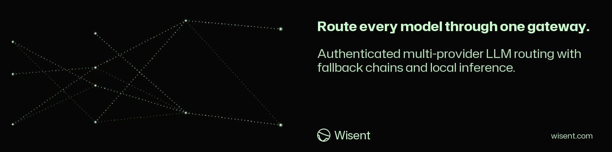

<!-- wisent-banner:start -->
<p align="center">
  
</p>
<!-- wisent-banner:end -->

<!-- wisent-readme-signals:start -->
[](https://github.com/wisent-ai/brama) [](https://github.com/wisent-ai/brama/issues) [](https://wisent.ai) [](https://discord.gg/qRjpkthq54) [](https://www.linkedin.com/company/wisent-ai/) [](https://x.com/wisentai) [](https://calendly.com/lbartoszcze)
<!-- wisent-readme-signals:end -->

# Brama: Keep All Your Models Accessible Through One Endpoint

All Models and Providers United in One API.

Brama is the simplicity your stack needs. One API, one identity, uniting every
model you own in one API. When you switch from Claude-Cthulu to GPT-Bazillion or
cancel your subscription, you won’t have to update it everywhere. Define
heuristics such as best, fast, or cheap to call this endpoint with intelligent
routing. And every token is attributed, so you can audit where your subscription
and API money is going. Host it anywhere — even on remote devices.

Canonical repository: [`wisent-ai/brama`](https://github.com/wisent-ai/brama).
The product, Rust crate, binary, CLI, MCP server, and service are named `brama`.

## Problem and intended users

Wisent services need models from several providers without copying provider
credentials into every caller, coupling callers to provider wire formats, or
silently charging the wrong account. Direct provider integrations also duplicate
model discovery, OAuth refresh, retry, error handling, and access policy.

Brama serves four audiences:
- **Desktop users** run a private Brama process on their own computer and add
  their own provider credentials or subscriptions.
- **Wisent service developers** use one OpenAI-compatible API and stable logical
  aliases instead of provider credentials and provider-specific clients.
- **Jeden runtimes** use an agent-bound HMAC identity to discover and spend only
  subscriptions delegated to that exact agent.
- **Operators** publish immutable runtimes, grant finite Skarbiec capabilities,
  configure aliases and client allowlists, and diagnose routing without exposing
  secret material.

Brama is preferable to direct integrations when the required outcome is one
least-privilege enforcement point with explicit billing ownership, bounded
provider attempts, normalized errors, and auditable routing decisions.

## Product boundaries

### Included

- OpenAI-compatible chat completions, embeddings, moderations, and model catalog.
- Canonical `provider/model` routing and deployment-owned logical aliases,
  including `-best` for the strongest operator-approved subscription route.
- Agent-scoped selectors: `any`, `any-vision-capable`, and `task:<task-name>`.
- Direct provider capabilities owned by Brama and subscription capabilities
  delegated to one agent.
- Final-use secret redemption through the local Skarbiec capability socket in
  managed deployments, or a zeroizing in-memory credential map in standalone
  desktop deployments.
- Bounded credential rotation for authentication, quota, and rate-limit failures.
- OAuth refresh for Claude Code, Codex, and Kimi subscription credentials.
- An append-only operational journal for retirement and task-quality evidence.
- Secret-free build identity, health, statistics, hardware detection, and a
  read-only stdio MCP surface.

### Explicit non-goals

- Running Claude Code, Codex, Kimi Code, OpenCode, or any other agent runtime.
  Jeden is the agent runtime; Brama performs provider HTTP requests only.
- Starting or supervising a local inference engine. The deployment owner controls the
  digest-pinned vLLM lifecycle; Brama reads its owner-only route snapshot and performs
  authenticated OpenAI-compatible requests over the target's Tailscale address.
- Acting as a general secret store, identity provider, billing ledger, or system
  of record for provider accounts.
- Inferring task intent from prompt text. `task:` uses previously recorded,
  explicitly named quality evidence only.
- Silent fallback across products, agents, provider accounts, credentials, or
  storage authorities.
- Owning production DNS, ingress, host registration, orchestration, or Skarbiec grants.
- Streaming OpenAI responses to callers. The current HTTP contract returns one
  buffered completion.

### Supported environments and current capability

| Capability | Environment | Current state |
|---|---|---|
| `brama detect` and read-only MCP detection | macOS or Linux | Implemented |
| OpenAI-compatible HTTP gateway | Linux service host; authenticated loopback is also supported | Implemented |
| Direct API-provider routing | Provider capability configured in Skarbiec | Implemented |
| Agent subscription routing | Jeden HMAC identity plus delegated capability | Implemented |
| Claude Code donation endpoint | Authorized agent and entitlements router | Implemented |
| Deployment-managed local inference routing | Linux GPU target over Tailscale | Implemented |
| Outbound response streaming | — | Not supported |
| Immutable public release | Canonical Stado channels for `linux-amd64` and `darwin-arm64` | Implemented; `released-surface.json` names the newest recorded release |
| Per-installation Skarbiec trust material | Operator-managed host | Implemented; `bin/provision-skarbiec-trust` generates it and the launcher refuses to start without it |
| Declared 1.0 contract stability | — | Not yet declared |

The current-state column is authoritative. Unavailable capability must not be
advertised by the API, MCP server, examples, or release notes.

## Core use cases

### Call a deployment-owned model alias

- **Actor:** an authenticated Wisent service.
- **Initial state:** the service has its dedicated bearer and the alias maps to a
  configured direct-provider route, optionally followed by ordered fallback
  routes.
- **Outcome:** Brama validates transport, identity, allowlist, and request limits;
  invokes the primary, then each fallback only after a failed attempt, and
  returns the first normalized success or the final normalized failure.
- **Safety boundary:** no agent subscription is discovered or charged; every
  fallback names an explicit provider capability.

### Use an exact agent subscription

- **Actor:** a Jeden runtime with a bearer bound to its `agent_id`.
- **Initial state:** the agent signs the exact request body and owns an active
  delegated provider capability.
- **Outcome:** Brama redeems the selected credential at final use and returns the
  normalized provider result.
- **Safety boundary:** `billingTarget` must name the same provider and an active
  subscription belonging to the signed agent.

### Select an available or task-ranked model

- **Actor:** an authenticated Jeden runtime.
- **Initial state:** the agent has active subscriptions; `task:` additionally
  requires persisted quality observations for the named task.
- **Outcome:** Brama chooses eligible candidates, applies the documented bounded
  attempt policy, and stops at the first successful provider result.
- **Cost boundary:** selectors may invoke more than one provider attempt; limits
  are defined in [`CORE.md`](CORE.md). They never retry without a finite bound.

### Operate and recover the gateway

- **Actor:** a Brama operator.
- **Initial state:** an immutable runtime and its scoped Skarbiec grants are
  available on the operator-managed Linux host.
- **Outcome:** health and version output identify the build; structured routing
  logs and protected stats explain bounded decisions without secret material.
- **Recovery boundary:** rollback restores one immutable runtime coordinate and
  compatible non-secret journal state as described in [`RELEASE.md`](RELEASE.md).

## How Brama works

```text
Wisent service / Jeden
        │ HTTPS or authenticated loopback
        │ dedicated bearer
        │ optional exact-body agent HMAC
        ▼
     Axum ingress ── client binding + model allowlist + request limits
        │
        ├── logical alias ──────────────── direct provider capability
        ├── canonical provider/model ──── direct or agent subscription
        └── any / vision / task ───────── bounded candidate selection
                                                │
                                                ▼
                            entitlements-router metadata discovery
                                                │
                                                ▼
                         Skarbiec final-use capability redemption
                                                │
                                                ▼
                              provider protocol adapter + timeout
                                                │
                                                ▼
                         normalized response, error, metrics, journal
```

Skarbiec is authoritative for secret capability redemption. The entitlements
router is authoritative for live subscription resources. `-best` is an explicit
deployment alias for `codex/gpt-5.3-codex-spark`; a caller still needs both an
allowlisted bearer and the HMAC identity that owns the eligible subscription.
It does not infer quality from prompt text or unlock a direct provider
credential. Brama's journal stores only retirement markers and task-quality
observations; provider credentials are forbidden. Public model metadata is read
from models.dev and is never credential authority.

## Quick start

The normal path is the newest published release. `brama detect` is the safe first
command either way: it reads local hardware, performs no provider request, reads
no credential, creates no Brama state, and incurs no model cost.

Install the archive for your platform and verify its published checksum before
extracting it:

```bash
# List published releases and choose one. There is no `latest` production
# contract, so the version is selected deliberately, never resolved for you.
curl --fail --silent --proto '=https' --tlsv1.2 \
  https://api.github.com/repos/wisent-ai/brama/releases | grep '"tag_name"'

version=<chosen SemVer, without the v prefix>
platform=darwin-arm64   # or linux-amd64
base="https://github.com/wisent-ai/brama/releases/download/v${version}"
curl --fail --location --proto '=https' --tlsv1.2 --remote-name-all \
  "${base}/brama-v${version}-${platform}.tar.gz" \
  "${base}/brama-v${version}-${platform}.tar.gz.sha256"
shasum -a 256 --check "brama-v${version}-${platform}.tar.gz.sha256"
tar -xzf "brama-v${version}-${platform}.tar.gz"
./bin/brama detect
```

Serving traffic takes more than the archive. Provision this installation's trust
material once with `bin/provision-skarbiec-trust` — the archive ships no signing
key and the launcher refuses to start until that material exists — then read
[`ONBOARDING.md`](ONBOARDING.md) before the first authenticated request.

Maintainers working on unreleased source run the same command from a checkout,
which needs Git and the Rust toolchain required by `Cargo.lock` (the production
build uses the pinned builder in `Dockerfile`):

```bash
git clone https://github.com/wisent-ai/brama.git brama
cd brama
cargo run --locked -- detect
```

Expected output contains these fields with host-specific values:

```text
GPU Type: ...
VRAM: ... GB
RAM: ... GB
CPU Cores: ...
Recommended model: ...
Recommended backend: ...
```

Neither command starts a service. The checkout path may leave build output under
`target/`; it is a local build cache, not product state. Continue with
[`ONBOARDING.md`](ONBOARDING.md) for the authenticated loopback and production
operator paths. Runnable, risk-labeled workflows are indexed in
[`examples/`](examples/README.md).

## Primary interfaces

- **HTTP inference:** `POST /v1/chat/completions`, `/v1/embeddings`, and
  `/v1/moderations` are the canonical model-execution interfaces.
- **Account subscriptions:** authenticated Wisent users use
  `GET|POST /v1/account/subscriptions` and
  `DELETE /v1/account/subscriptions/:subscription_id`. Brama derives the
  subscription owner from the verified Wisent session; the caller never
  supplies an account or agent identifier.
- **HTTP discovery:** `GET /v1/models`; bearer-only discovery is public catalog
  scope, while signed discovery includes agent-owned availability.
- **Subscription lifecycle:** `GET`, `POST`, and `DELETE`
  `/v1/subscriptions/:agent_id`; always bearer- and HMAC-protected. A `GET`
  returns, per subscription, the plan windows the provider itself reported
  (`limits`: `used_fraction`, `window_label`, `resets_at_ms`), what Brama
  measured (`measured`: requests, failures, input and output tokens, first and
  last use), and any rate-limit `block` in force. An empty `limits` array means
  the provider publishes no plan state; it does not mean nothing was used.
- **Operations:** public `GET /health` and `GET /readyz`; protected `GET /stats`.
  `/health` is liveness only and says so in its body (`dependencies:
  not_probed`): it answers `ok` from a gateway whose every credential
  redemption is being refused. `/readyz` is the one that answers whether the
  product works: it redeems one capability per configured provider and returns
  `503` naming the providers that failed, with no secret in the body. Deploy
  checks and uptime monitors should read `/readyz`; `/health` only proves the
  process is running.
- **Error contract:** a refused redemption is `503 authorization_error` with
  code `credential_unauthorized` and `retryable: false`, never a `429
  capacity_error`. Waiting does not repair an authorization id that does not
  match, and classifying it as capacity sends the caller into retries and the
  operator into the subscription catalogue.
- **Desktop control plane:** `brama-desktop` alone may call
  `GET /v1/admin/snapshot`, `PUT /v1/admin/routes`, and the `GET`, `POST`, and
  `DELETE` `/v1/admin/subscriptions/:agent_id` family. These endpoints return
  identifiers, usage and status only; subscription credentials remain
  write-only.
- **CLI:** `serve`, `version`, `detect`, `test`, `collect-task-quality`, and
  `mcp`. Billable commands require an explicit cost acknowledgement.
- **MCP:** read-only stdio JSON-RPC exposing `brama_detect` only. Model execution,
  credential discovery, collection, and mutation are deliberately excluded.

The complete state, error, retry, authorization, and resource contract is in
[`CORE.md`](CORE.md). Provider capability and lifecycle contracts are in
[`INTEGRATIONS.md`](INTEGRATIONS.md).

## Operational model

- **Configuration:** production policy is generated by
  `scripts/start-with-skarbiec.sh` from operator-owned configuration and scoped
  secret consumers. Missing, malformed, duplicate, or contradictory security
  configuration fails startup.
- **Dynamic inference routes:** `BRAMA_INFERENCE_ROUTES_FILE` points at an
  owner-only snapshot maintained by the deployment operator. Brama reloads it
  per request, rejects symlinks and group/other-readable files, accepts only
  loopback or Tailscale IPv4 deployment endpoints, fails closed on malformed
  updates, and attempts centrally declared fallback routes in order.
- **Desktop credentials:** standalone Brama Desktop launches its bundled Brama
  binary on loopback, sends provider credentials once over the child process's
  standard input, and keeps both its router bearer and provider credentials out
  of process arguments, files, logs, and Brama state. A Stado-discovered Brama
  installation may instead acquire its scoped bearer from Skarbiec.
- **State:** `$BRAMA_STATE_DIR/journal.jsonl` contains retirement and quality
  records. `$BRAMA_SUBSCRIPTION_USAGE_FILE`, by default
  `~/.config/brama/subscription-usage.json` and owner-readable only, holds the
  per-subscription usage ledger: measured counters, the newest plan reading per
  window, and any block. It is written atomically and is not a cache — the
  question it answers spans months, not process lifetimes. `/tmp/brama-perf.json`
  contains replaceable process telemetry. The entitlements router owns encrypted
  subscription credential storage in managed deployments.
- **Subscription discovery:** a provider subscription is a Skarbiec item tagged
  `brama:subscription` and `brama:agent:<agent>`, carrying its provider and
  subscription id in `brama:provider:<provider>` and `brama:id:<id>`. Both the
  gateway and Brama Desktop filter on those tags, so vault item ids are opaque
  and renaming one changes nothing. `scripts/provision-desktop-subscriptions.py`
  writes the owner vault and `scripts/provision-host-subscriptions.sh` writes a
  managed host's vault; both are idempotent and derive their tags from
  `scripts/skarbiec-subscriptions.json`.
- **Credentials:** callers use dedicated bearer items. Request-sign identities
  and provider capabilities remain separate. Secrets are redeemed at final use
  and are not written to JSON configuration, logs, or Brama state. Standalone
  launchers pass a provider-to-credential JSON object to
  `brama serve --local-credentials-stdin` over standard input.
- **Network:** Brama binds to loopback. Standalone desktop clients use their
  bundled process; managed clients may discover a local Brama service through
  Stado. Provider endpoints require approved HTTPS hosts, disable redirects,
  and bypass ambient proxies.
- **Failure:** stable HTTP error codes distinguish invalid input, authentication,
  authorization, quota, timeout, dependency unavailability, and provider
  failure. Retryability is included in the error envelope.
- **Observability:** health and `brama version` expose secret-free build identity;
  structured logs record routing mode, selected route, attempts, outcome, and
  remediation class. `/stats` remains bearer-protected.
- **Upgrade and rollback:** follow [`RELEASE.md`](RELEASE.md). Immutable product
  version, source revision, platform, digest, and provenance are separate facts.
- **Qualification:** evidence groups and consent boundaries are defined in
  [`TESTING.md`](TESTING.md).

## Project status and support

- **Maturity:** pre-1.0. Public contract changes follow the `0.x` policy in
  [`RELEASE.md`](RELEASE.md).
- **Current source version:** the `version` field in `Cargo.toml`, which is the
  single canonical source; this page does not duplicate the number.
- **Supported source:** public `main` for development; immutable releases are
  built, stored, and promoted through Stado.
- **Issues and operator support:**
  [`wisent-ai/brama` issues](https://github.com/wisent-ai/brama/issues);
  see [`SUPPORT.md`](SUPPORT.md).
- **Security reports:** use the private GitHub Security Advisory channel defined
  in [`SECURITY.md`](SECURITY.md); never put credentials in an issue.
- **License:** Apache License 2.0; see [`LICENSE`](LICENSE).

Rust code defines executable behavior. This README owns the product promise,
boundaries, use cases, terminology, status, and operator entry points. Detailed
documents must link here and must not claim a conflicting capability state.