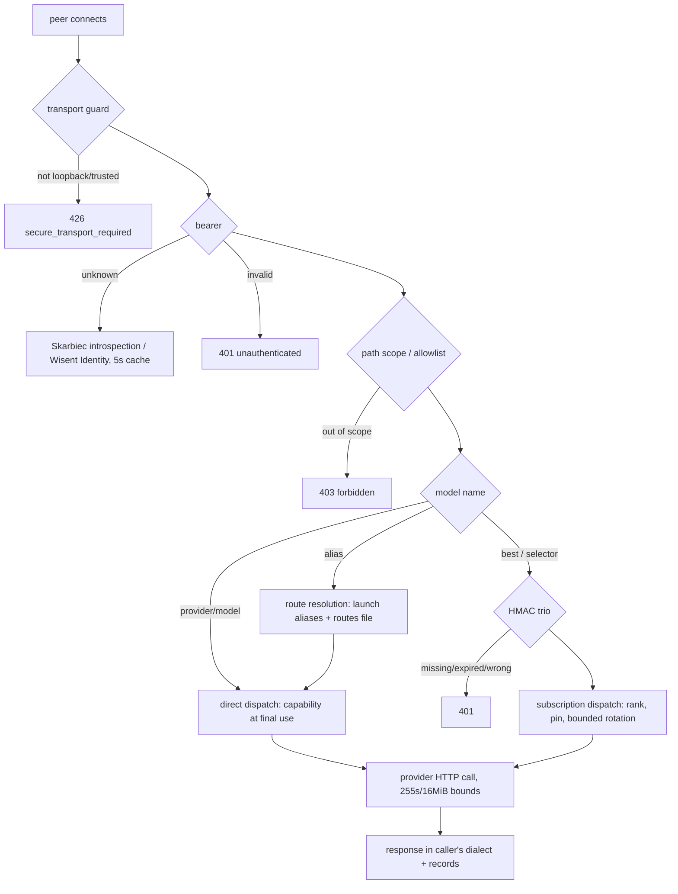

# Architecture

What Brama owns, what it deliberately does not, and how one request flows
through it. Brama is one Rust process (axum) serving one HTTP listener; its
entire job is to turn an authenticated, alias-shaped model request into at
most a bounded handful of provider HTTP calls, paying with a credential it
held for exactly one call.

## What Brama owns

- **Routing.** Alias resolution, selector ranking, fallback ordering, and
  the bounded dispatch that follows ([concepts/alias](concepts/alias.md),
  [concepts/entitlement](concepts/entitlement.md)). The admin snapshot
  states the boundary split it operates under:
  `"boundaries": {"credentials": "skarbiec", "releases": "stado",
  "routing": "brama"}` (captured from `/v1/admin/snapshot`).
- **The credential seam.** Redeeming capabilities and subscription
  credentials at final use, refreshing OAuth grants ahead of expiry, and
  recording what each redemption concluded
  ([concepts/capability](concepts/capability.md),
  [concepts/subscription](concepts/subscription.md)).
- **Its own records.** The usage ledger, the append-only journal, process
  telemetry, and the donated-subscriptions metadata overlay (state layout
  below).

## What Brama is not

- Not an agent runtime — Jeden is the runtime; Brama performs provider HTTP
  requests only.
- Not placement — Stado owns placement and stages the owner-only inference
  route snapshot Brama re-reads per request
  ([concepts/alias](concepts/alias.md#dynamic-routes-the-routes-file)).
- Not a secret store — Skarbiec is the authority for credentials; Brama
  receives capability handles until the final-use seam and holds no secret
  at rest.
- Not an identity provider, billing ledger, or system of record for
  provider accounts; and it never infers task intent from prompt text —
  `task:` selectors use previously recorded, explicitly named quality
  evidence only.

## One listener, two routers

`brama serve` binds one address (loopback unless `BRAMA_BIND_ADDRESS` names
an IP) and mounts two route sets (`src/core/server.rs:3400-3455`): a public
pair — `/health`, `/readyz` — and seventeen bearer-protected routes. Every
route, including `/health`, sits behind the transport guard.

## The request path

Validation is strict before any provider is considered: unknown JSON fields
are refused, `max_tokens` is bounded at 32768, `temperature` at 2, and a
model name outside the four-part vocabulary is
`400 invalid_request` ([http-api](http-api.md)). Every failure is logged
beside the client body as a fleet envelope
([concepts/envelope](concepts/envelope.md)).

## Trust boundaries

| Boundary | Rule |
|---|---|
| Transport | loopback, own bound address, `BRAMA_ENCRYPTED_PEER_IPS`, or `BRAMA_TRUSTED_PROXY_IPS` with `https` forwarded headers; everything else `426`. Forwarded headers from unlisted peers are never trusted |
| Caller | bearer table (constant-time) → Skarbiec introspection → Wisent Identity; verdicts cached 5 s; fail closed ([concepts/client-identity](concepts/client-identity.md)) |
| Agent | HMAC-SHA256 trio over the exact raw body, ±300 s; bearer-bound, signed, and path agents must agree ([concepts/entitlement](concepts/entitlement.md)) |
| Admin | `/v1/admin/*` answers only `brama-desktop`; `/v1/account/*` only a verified Wisent user session (`brama-user`) |
| Secrets | Skarbiec broker socket, owner-bound; capabilities single-use, ≤1 h; plaintext only inside the one provider call; standalone mode keeps a zeroizing in-memory map |
| Providers | exact trusted HTTPS hosts, redirects disabled, ambient proxies bypassed; loopback only via explicit `BRAMA_PROVIDER_<X>_BASE_URL` override ([concepts/provider](concepts/provider.md)) |
| Routes file | owner-only regular file, no symlink, no group/other access; endpoints loopback or Tailscale IPv4 only |
| Vault listing | shelled to the local entitlements router; donated plaintext crosses only the request body and the router's stdin pipe |

## `/health` versus `/readyz`

The evidence rule, stated once: **a green `/health` is evidence the process
exists; a green `/readyz` is evidence the product works. Nothing else about
the gateway may be concluded from `/health`.**

`/health` never redeems a credential, lists subscriptions, or contacts a
provider, and its body says so — `"dependencies": "not_probed"`. It answers
`ok` from a gateway whose every redemption is being refused (verified: a
standalone gateway with a garbage credential answers `/health` `ok`).

`/readyz` earns its verdict per request: it redeems one capability per
configured provider through the same broker call the request path makes,
checks that every active subscription contributes at least one discoverable
model, redeems one credential per active subscription, and reports vault
subscription accounts that carry no `brama:agent:` tag. `ready` is true only
when all four pass and at least one provider capability is configured;
otherwise the status is `503` and `reason` is one of the five sentences in
the [runbook](runbook.md#readyz-answers-503) — with `providers`, `denied`,
`routing`, `unroutable`, `subscriptions`, `unredeemable`,
`unroutable_accounts`, `operator_action_required`, and `build` beside it,
and never a secret. Deploy gates and uptime monitors read `/readyz`.

## State on disk

Everything Brama writes, and what it never writes:

| Path (default) | Contents |
|---|---|
| `$BRAMA_STATE_DIR/journal.jsonl` (`~/.brama/`) | append-only records: `retire`, `subscription_refresh`, `check` (task quality); readers take the last matching record; never credential material |
| `BRAMA_SUBSCRIPTION_USAGE_FILE` (`~/.config/brama/subscription-usage.json`) | the usage ledger: measured counters, plan windows, blocks, credential state, probe verdicts; atomic owner-only writes |
| `BRAMA_DONATED_SUBSCRIPTIONS_FILE` (`/tmp/brama-skarbiec/donated-subscriptions.json`) | donation metadata only, atomic 0600 rewrite |
| `BRAMA_PERF_PATH` (`/tmp/brama-perf.json`) | replaceable per-model latency/throughput telemetry |
| `BRAMA_MODEL_CATALOG_CACHE` (`/tmp/brama-models-dev-cache.json`) | replaceable models.dev cache |
| `~/.local/state/brama/onboarding.json` | onboarding journey progress |

Secrets live in Skarbiec; tokens and grants cross Brama only in memory.
Process telemetry is not durable billing evidence; the ledger is the record
that spans months.

## Neighbours

- **Skarbiec** issues and redeems capabilities, introspects bearers, and
  stores subscription grants; the launcher provisions this installation's
  workload trust material once.
- **Stado** declares inference deployments and desired routes and stages the
  route snapshot; Brama reloads it per request and never supervises the
  engine behind it.
- **Jeden** (and the other agents) call Brama with a bearer plus their HMAC
  identity; their subscriptions pay for `best` and the selectors.
- **Brama Desktop** is the operator console behind the `brama-desktop`
  identity; **Wisent Identity** verifies desktop user sessions for the
  account routes.
